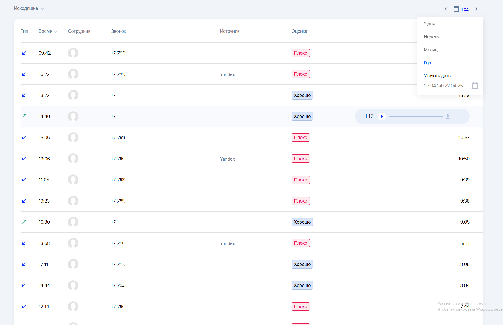
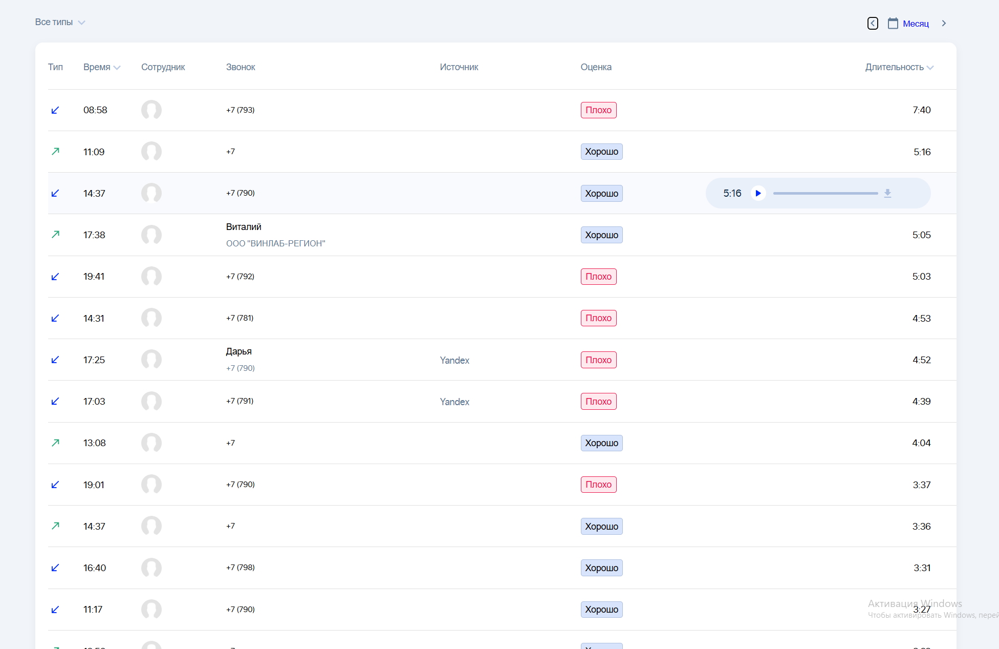

> # Приложение для просмотра и управления списком звонков с тестового API Skilla.

## 📋 Содержание

-   [О проекте](#-о-проекте)
-   [Функционал](#-функционал)
-   [Технологии](#-технологии)
-   [Установка](#%EF%B8%8F-установка)
-   [Настройка](#-настройка)
-   [Использование](#-использование)
-   [Структура проекта](#-структура-проекта)
-   [API](#-api)
-   [Скриншоты](#-скриншоты)
-   [Лицензия](#-лицензия)

---

## 🔍 О проекте

Приложение отображает список звонков, полученных с тестового API Skilla (`https://api.skilla.ru/testapi`).

**Тестовый токен:**

```bash
testtoken
```

Проект демонстрирует работу с:

-   Динамической выборкой по диапазону дат
-   Фильтрацией и сортировкой данных через API
-   Воспроизведением аудиозаписей звонков
-   Бесконечной прокруткой (infinite scroll)

## 🚀 Функционал

-   🎛️ **Фильтрация звонков** по типу: входящие, исходящие или все.
-   📅 **Диапазон дат**: выбор стартовой и конечной даты через Date Picker.
-   🔊 **Проигрывание записи**: воспроизведение аудио при наличии записи.
-   ↕️ **Сортировка** по дате и длительности через API.
-   📈 **Бесконечная прокрутка**: подгрузка новых данных при скролле.

## 🛠️ Технологии

-   **Frontend:** React, TypeScript
-   **UI:** react-table, react-datepicker
-   **Запросы:** axios / fetch
-   **Стили:** CSS Modules, SCSS

## 🏗️ Установка

1. Клонируйте репозиторий:
    ```bash
    git clone https://github.com/yourusername/yourrepo.git
    cd yourrepo
    ```
2. Установите зависимости:

    ```bash
    npm install
    ```

3. Запустите приложение в режиме разработки:
    ```bash
    npm run start
    ```

## ⚙️ Настройка

-   **Токен и URL API** для простоты лежат в src/constants
-   **Количество записей** и параметры сортировки можно изменить в `buildParams`.

## 📝 Использование

1. Выберите нужный диапазон дат через Date Picker.
2. Отфильтруйте звонки по типу (All, In, Out).
3. Кликните по иконкам сортировки для изменения порядка.
4. Прокручивайте страницу для подгрузки новых звонков.
5. При наличии записи нажмите кнопку "play" для воспроизведения.

## 🗂️ Структура проекта

```text
src/
├── api/                # HTTP-клиент и методы API
├── components/         # UI-компоненты
│   ├── CallTable/      # Основной контейнер для таблицы звонков
│   ├── CallListItem/   # Компонент для отображения отдельного звонка
│   ├── MainLayout/     # Основной макет страницы
│   ├── AudioPlayer/    # Компонент для аудио плеера
│   └── ui-kit/         # Прочие UI-компоненты
├── hooks/              # Кастомные хуки
├── types/              # TypeScript-типы
├── utils/              # Утилиты
├── pages/              # Страницы приложения
├── styles/             # Глобальные стили, темы, CSS переменные
├── shared/             # Общие компоненты, стили и утилиты
│   └── ui-kit/         # Базовые UI-компоненты
└── App.tsx             # Точка входа

```

## 🌐 API

### Получение списка звонков

```http
GET /Calls
Authorization: Bearer <token>
```

**Параметры:**

| Параметр     | Описание                              | Пример       |
| ------------ | ------------------------------------- | ------------ |
| `date_start` | Начало диапазона (YYYY-MM-DD)         | `2023-04-01` |
| `date_end`   | Конец диапазона (YYYY-MM-DD)          | `2023-04-30` |
| `type`       | Тип звонка: `all` \| `in` \| `out`    | `all`        |
| `sort_by`    | Поле сортировки: `date` \| `duration` | `date`       |
| `order`      | Порядок: `ASC` \| `DESC`              | `DESC`       |
| `limit`      | Количество записей                    | `30`         |
| `offset`     | Смещение для пагинации                | `0`          |

## 📸 Скриншоты




```

```
